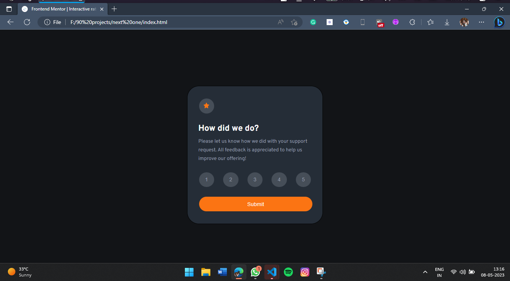
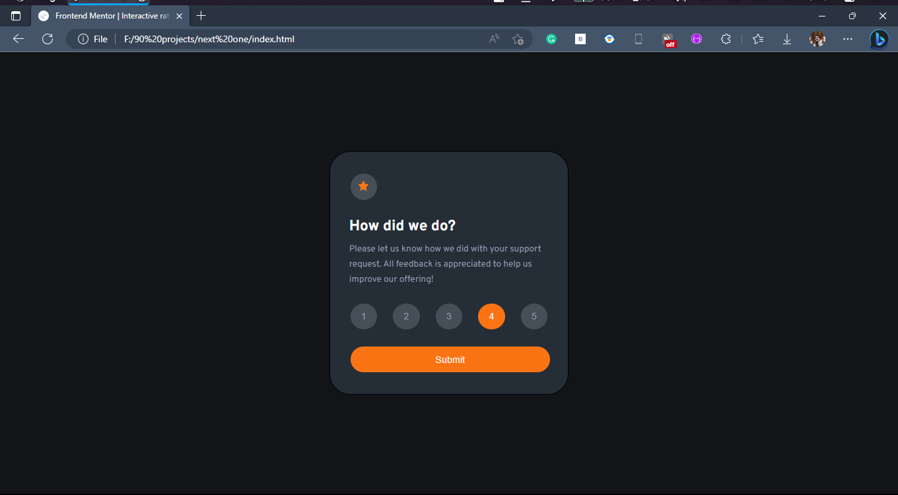

# Frontend Mentor - Interactive rating component solution

This is a solution to the [Interactive rating component challenge on Frontend Mentor](https://www.frontendmentor.io/challenges/interactive-rating-component-koxpeBUmI). Frontend Mentor challenges help you improve your coding skills by building realistic projects. 

## Table of contents

- [Overview](#overview)
  - [The challenge](#the-challenge)
  - [Screenshot](#screenshot)
  - [Links](#links)
- [Styling Functionality](#my-process)
  - [HTML5 CSS3 Javascrit](#built-with)
  - [QuerySelector](#what-i-learned)
  - [Javacript](#continued-development)
  - [Useful resources](#useful-resources)
- [Mridul Garg](#author)

## Overview

### The challenge

Users should be able to:

- View the optimal layout for the app depending on their device's screen size
- See hover states for all interactive elements on the page
- Select and submit a number rating
- See the "Thank you" card state after submitting a rating

### Screenshot
- Home


- Active button


- Thank You Page


### Links

- Solution URL: [Add solution URL here]
- Live Site URL: [Add live site URL here]

## My process

### Built with

- Semantic HTML5 markup
- Flexbox
- JavaScript
- [React](https://reactjs.org/) - JS library


### What I learned

learned about Javascript querySelector and diffrent to get & put text;


```html
<div class="container selection" >
    <button class ="top" disabled></button>
    <h2>How did we do?</h2>

   <p>Please let us know how we did with your support request. All feedback is appreciated 
      to help us improve our offering!</p> 

    <div class="set">
      <button class ="noOf" name="1">1</button>
      <button class ="noOf" name="2">2</button>
      <button class ="noOf" name="3">3</button>
      <button class ="noOf" name="4">4</button>
      <button class ="noOf" name="5">5</button>
    </div>
```
```css
.set{
    margin-top: 22px;
    padding: 0px;
    display: flex;
    justify-content: space-between;
}
.noOf:active{
    background-color: var(--orange);
  color: var(--white);
}
```
```js
for (var j = 0; j < ratings.length; j++) 
            {
                if(ratings[j].classList.contains('selected'))
                {
                   ratings[j].classList.remove('selected');
                } 
            }
            this.classList.add('selected');  

            button.addEventListener("click",function()
            {
                selection.style.display = 'none';
                thankYou.style.display = 'flex';
                span.innerHTML = btn;
            });
```


### Continued development

JavaScript enabled projects

### Useful resources

- [https://stackoverflow.com/questions/4838351/how-to-modify-a-css-display-property-from-javascript] - This helped me in manipulating display properties in java script.

## Author

- Website - [Mridul Garg]
- Frontend Mentor - [@Mridul07garg](https://www.frontendmentor.io/profile/Mridul07garg)
- Twitter - [@MridulG27253526](https://www.twitter.com/MridulG27253526)
- LinkenIn - [@mridul-garg-072004](https://www.linkedin.com/in/mridul-garg-072004/)

